Typora是一款免费的轻量级Markdown编辑器

## 基本用法

#### 	标题与目录

在文章开始地方输入[toc]，即可在对应位置插入目录。

标题：

-  \# 一阶标题 （快捷键Ctrl+1）

-  \## 二阶标题 （快捷键Ctrl+2）

-  \### 三阶标题 （快捷键Ctrl+3）

-  \#### 四阶标题 （快捷键Ctrl+4）

-  \#####五阶标题 （快捷键Ctrl+5）

-  \###### 六阶标题 （快捷键Ctrl+6）

## 基本语法

- 文本居中：==\<center>居中的文本内容\</center>==
- 下划线：==\<u>。。。<\u>== 或者快捷键Ctrl+U
- 删除线：==~~==
- 水平分割线：==*** 或 ---==
- 斜体：==* 。。。 *==
- 粗体：==** 。。。 **==

### 表格

#### 简单表格

```
| 左对齐 | 右对齐 | 居中对齐 |
| :-----| ----: | :----: |
| 单元格 | 单元格 | 单元格 |
| 单元格 | 单元格 | 单元格 |
```

#### 复杂表格

markdown 默认只支持简单类型表格，但是typro可通过HTML实现复杂表格：

- style： 设定样式；
- colspan：设定合并几列；
- rowspan：设定合并几行；

```
<table>
	<tr>
		<td style="text-align:center;vertical-align:middle;" colspan="3" bgcolor=#C9C9C9>Stream API</td> 
	</tr>
	<tr>
		<td rowspan="2" bgcolor=#C1C1C1>中间操作</td>
		<td>无状态</td>    
		<td width="%80">unordered()</td>
	</tr>
	<tr>
		<td>有状态</td> 
		<td>distinct()</td>
	</tr>
	<tr>
		<td rowspan="2" bgcolor=#C1C1C1>结束操作</td>
		<td>非短路操作</td>    
		<td>forEach()</td>
	</tr>
	<tr>
		<td>短路操作</td> 
		<td>anyMatch()</td>
	</tr>
</table>
```

<table>
	<tr>
		<td style="text-align:center;vertical-align:middle;" colspan="3" bgcolor=#C9C9C8>Stream API</td> 
	</tr>
	<tr>
		<td rowspan="2" bgcolor=#C1C1C1>中间操作</td>
		<td>无状态</td>    
		<td width="%80">unordered()</td>
	</tr>
	<tr>
		<td>有状态</td> 
		<td>distinct()</td>
	</tr>
	<tr>
		<td rowspan="2" bgcolor=#C1C1C1>结束操作</td>
		<td>非短路操作</td>    
		<td>forEach()</td>
	</tr>
	<tr>
		<td>短路操作</td> 
		<td>anyMatch()</td>
	</tr>
</table>


#### 数学公式

==Typora==中可方便地插入数学公式：

- 输入两个（ ‘ （`（‘$`）回车后即可插入数学公式：独立行、且居中；
- 在两个$中间插入公式：需要先设定（偏好设置-Markdown-内联公式 选中）；此公式则行内显示。

### 基本运算符

#### 上下标、根号与分数

上下标若多于一个符号，只需使用括号（{}）括起即可：

- 下标（_下划线）；放在字符下时，加上==\limits==

- 上标（==^==)

- 根号（==\sqrt==）

- 分数（==\frac{up}{down}==）

  

==x_{ij} 、y^{ij} 、\max \limits_{a<x<b}\{f(x)\}、\frac{up}{down}==
$$
x_{ij} 、y^{ij} 、\max \limits_{a<x<b}\{f(x)\}、\frac{up}{down}
$$
 ==\sqrt{b}、 \sqrt[a]{b}==
$$
\sqrt{b}、 \sqrt[a]{b}
$$

#### 大号括号

==()、[] 和 |== 表示符号本身，使用==\ \{\\}== 来表示 {} 。当要显示大号的括号或分隔符时，要用 \left 和 \right 命令。

```java
\left[
\frac{(x_{ij})_{max}^2}{MSE}
\right]
```

$$
\left[
\frac{(x_{ij})_{max}^2}{MSE}
\right]
$$

若要只显示一边，此时需要使用==\left. 和 \right==.匹配（即，不需要显示的那边用点号替换）；如：

```
\left. \frac{{\rm d}u}{{\rm d}x} \right|_{x=0}
```


$$
\left. \frac{{\rm d}u}{{\rm d}x} \right| _{x=0}
$$

一些特殊的括号：

|  输入   | 显示 |  输入   | 显示 |
| :-----: | :--: | :-----: | :--: |
| \langle |  ⟨   | \rangle |  ⟩   |
| \lceil  |  ⌈   | \rceil  |  ⌉   |
| \lfloor |  ⌊   | \rfloor |  ⌋   |
| \lbrace |  {   | \rbrace |  }   |

#### 修改大小

若需要显示更大或更小的字符，在符号前插入 \large 或 \small 命令。

```
\large A A \small A
```

$$
\large A A \small A
$$

换行与对齐
通过==\begin{aligned} ...... \end{aligned}==，在公式中，用==\\\\== 表示换行， 用==&==表示对齐。

```
\begin{aligned} 
		X
		&= (a+b)^2 \\
		&= a^2+b^2+2ab
\end{aligned}
```

$$
\begin{aligned} 
		X
		&= (a+b)^2 \\
		&= a^2+b^2+2ab
\end{aligned}
$$

#### 运算符

- \pm: ±
- \mp:∓ 
- \times: ×
- \cdot: ⋅（点号）
- \div: ÷
- \neq: ≠
- \equiv: ≡
- \leq: ≤
- \geq: ≥
- \approx:≈

==a\pm{b}、 a\div{b}==
$$
a\pm{b}、 a\div{b}
$$

#### 关系运算符

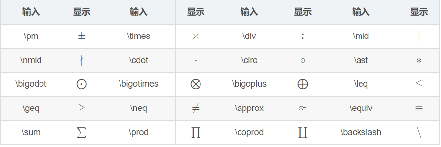

#### 集合运算符

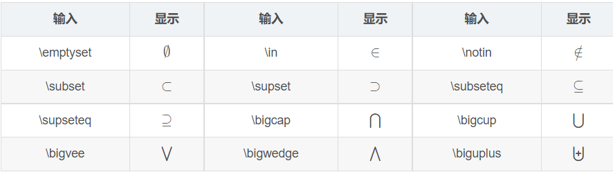

#### 对数运算符

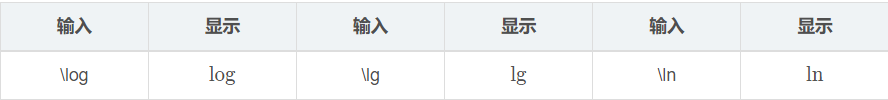

#### 三角运算符


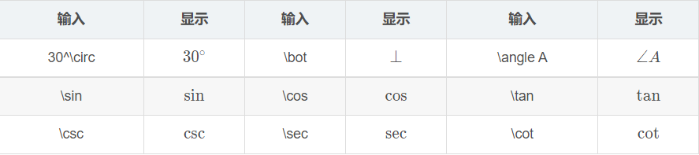

#### 微积分运算符

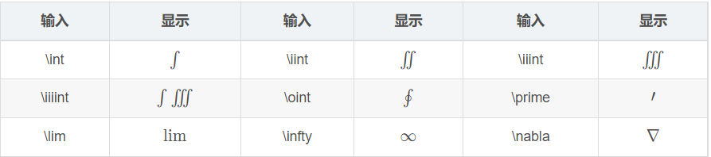

#### 逻辑运算符

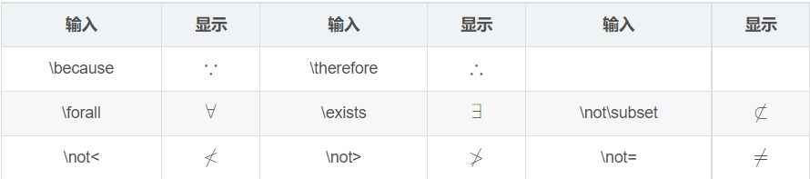

### 戴帽符号

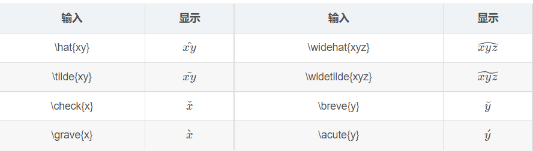

### 连线符

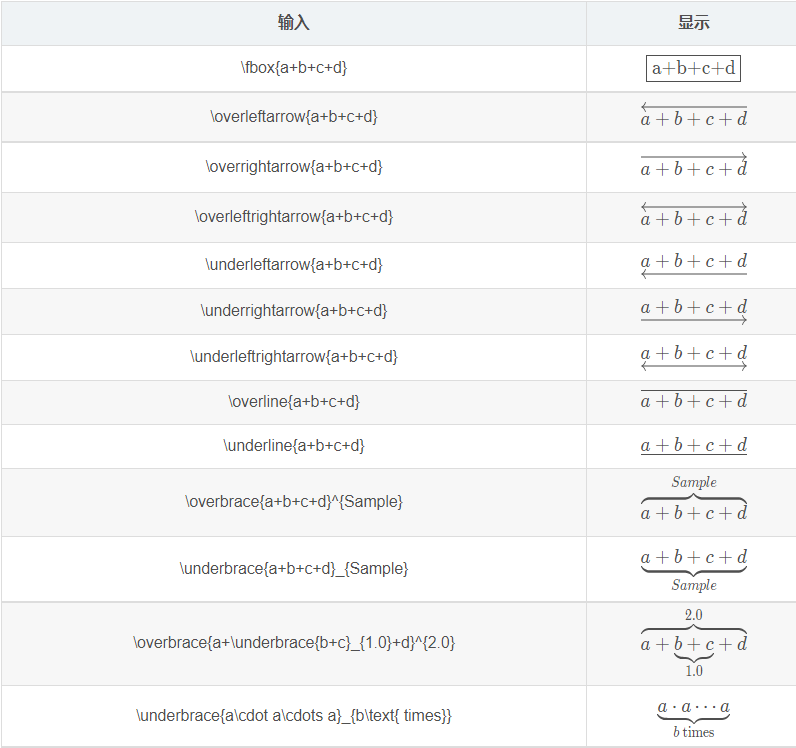

#### 求和、积分等

- 求和：==\sum(a)、\sum_1^ n、\sum\limits_{i=1}^n==；$\sum(a)、\sum_1^ n、\sum\limits_{i=1}^n$
- 求积：==\prod{x}、\prod_{n=1}^ {10}{x_n}、\prod\limits_{n=1}^{10}{x_n}==；$\prod{x}、\prod_{n=1}^ {10}{x_n}、\prod\limits_{n=1}^{10}{x_n}$
- 积分：==\int_0^1f(x)dx==；$\int_0^1f(x)dx$
- 微分：==\partial==；$\partial$
- 一阶二阶导数：==\dot{x}、\ddot{x}==；$\dot{x}、\ddot{x}$
- 极限：==\lim_{n\rightarrow\infty}{n}、\lim\limits_{n\rightarrow\infty}{n}==；$\lim_{n\rightarrow\infty}{n}、\lim\limits_{n\rightarrow\infty}{n}$
- 对数：==\ln{x}、\log_a{x}==;$\ln{x}、\log_a{x}$
- 矢量：==\vec{F}==；$\vec{F}$
- 算术平均值：==\bar{a}==；$\bar{a}$
- 概率分布:==\hat{a}==；$\hat{a}$
- 平均数运算:==\overline{xyz}==；$\overline{xyz}$

#### 矩阵、行列式、方程式

多行多列的式子，都是使用==&==分割同行元素，使用==\\==换行

- 矩阵：`\begin{matrix}...\end{matrix}`括起来，使用&分割同行元素，\换行；

  ```
  \begin{matrix}
  	1 & x & x^2\\
  	1 & y & y^2\\
  	1 & z & z^2\\
  	\end{matrix}
  ```

  $$
  \begin{matrix}
  	1 & x & x^2\\
  	1 & y & y^2\\
  	1 & z & z^2\\
  	\end{matrix}
  $$

  

- 行列式：在矩阵基础上添加`\left| ... \right|`

  ```
  X=\left|
  	\begin{matrix}
  		x_{11} & x_{12} & \cdots & x_{1d}\\
  		x_{21} & x_{22} & \cdots & x_{2d}\\
  		\vdots & \vdots & \ddots & \vdots \\
  		x_{11} & x_{12} & \cdots & x_{1d}\\
  	\end{matrix}
  \right|
  ```

  $$
  X=\left|
  	\begin{matrix}
  		x_{11} & x_{12} & \cdots & x_{1d}\\
  		x_{21} & x_{22} & \cdots & x_{2d}\\
  		\vdots & \vdots & \ddots & \vdots \\
  		x_{11} & x_{12} & \cdots & x_{1d}\\
  	\end{matrix}
  \right|
  $$

  

- 分段函数：==\begin{cases} ... \end{cases}==包括

  ```
  f(n)=
  	\begin{cases}
  		n/2, & \text{if $n$ is even}\\
  		3n+1,& \text{if $n$ is odd}
  	\end{cases}
  ```

  $$
  f(n)=
  	\begin{cases}
  		n/2, & \text{if $n$ is even}\\
  		3n+1,& \text{if $n$ is odd}
  	\end{cases}
  $$

  

- 方程组：

  ```
  \left\{
  	\begin{array}{c}
  		a_1x+b_1y+c_1z=d_1\\
  		a_2x+b_2y+c_2z=d_2\\
  		a_3x+b_3y+c_3z=d_3
  	\end{array}
  \right.
  ```

  $$
  \left\{
  	\begin{array}{c}
  		a_1x+b_1y+c_1z=d_1\\
  		a_2x+b_2y+c_2z=d_2\\
  		a_3x+b_3y+c_3z=d_3
  	\end{array}
  \right.
  $$

#### 	三角函数

以斜线\开始输入对应函数即可：

- \sin{\theta}：$\sin{\theta}$
- \tan{\theta}：$\tan{\theta}$

特殊字符：

- ==\forall==: $\forall$
- ==\exists==:$\exists$ 
- ==\partial==: $\partial$
- ==\infty==: $\infty$
- ==\emptyset==: $\emptyset$
- ==\cdots==: $\cdots$
- ==\nabla==: $\nabla$
- ==\bot==: $\bot$
- ==\angle==: $\angle$
- ==\because==: $\because$
- ==\therefore==: $\therefore$
- ==\quad==: $\quad$(空格）
- ==360^\circ==: $360^\circ$
- ==\in==: $\in$
- ==\notin==: $\notin$
- ==\subset==: $\subset$
- ==\supset==: $\supset$
- ==\subseteq==: 
- ==\supseteq==: $\supseteq$
- ==\cup==: $\cup$
- ==\cap==: $\cap$
- ==\setminus==: $\setminus$
- ==\bigodot==: $\bigodot$
- ==\bigoplus==: $\bigoplus$
- ==\\{==: $\{$
- ==\\}==:$\}$

#### 上下花括号：

- ==\overbrace{a+b+\dots+n}^{m个}==:$\overbrace{a+b+\dots+n}^{m个}$
- ==\underbrace{a+b+\dots+n}_{m个}==：$\underbrace{a+b+\dots+n}_{m个}$

#### 箭头

首字符大写时为双箭头、前面加long则为长箭头；

- ==\leftarrow==: $\leftarrow$
- ==\rightarrow==: $\rightarrow$
- ==\longleftarrow==: $\longleftarrow$
- ==\leftrightarrow==: $\leftrightarrow$
- ==\Leftarrow==: $\Leftarrow$
- ==\Longrightarrow==: $\Longrightarrow$
- ==\Leftrightarrow==: $\Leftrightarrow$
- ==\Longleftrightarrow==: $\Longleftrightarrow$
- ==\uparrow==: $\uparrow$
- ==\Downarrow==:$\Downarrow$
- ==\Updownarrow==: $\Updownarrow$

#### 希腊字母

输入 ==\小写希腊字母英文全称==` 和 `==\首字母大写希腊字母英文全称==来分别输入小写和大写希腊字母。

**对于大写希腊字母与现有字母相同的，直接输入大写字母即可**

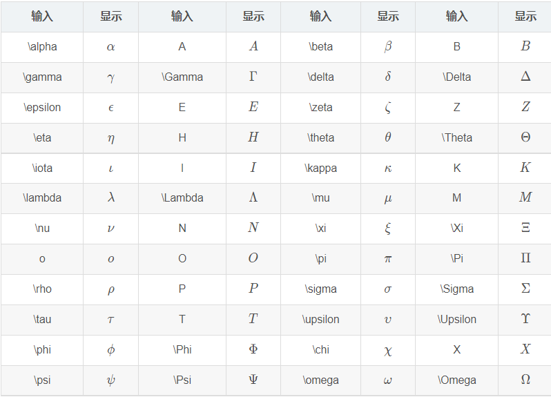

#### 变量专用形式

部分字母有变量专用形式，以 ==\var-==开头。

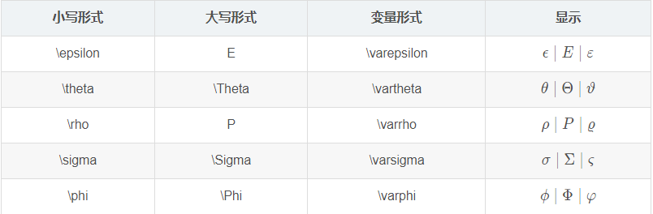

#### 字体

若要对公式的某一部分字符进行字体转换，可以用=={\字体 {需转换的部分字符}}==命令，其中 ==\字体== 部分可以参照下表选择合适的字体。一般情况下，公式默认为意大利体 。

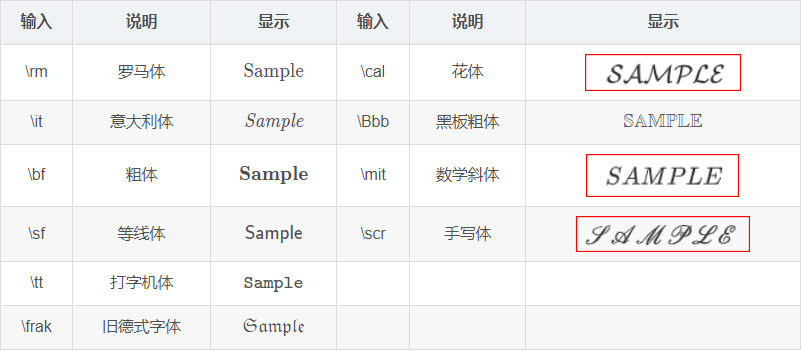


单个字符时可以省略括号，多个时需要加上：

```
\rm A  \it A \Bbb A \bf A  \sf A\\
\Bbb AB \Bbb {AB}
```

$$
\rm A  \it A \Bbb A \bf A  \sf A\\
\Bbb AB \Bbb {AB}
$$

